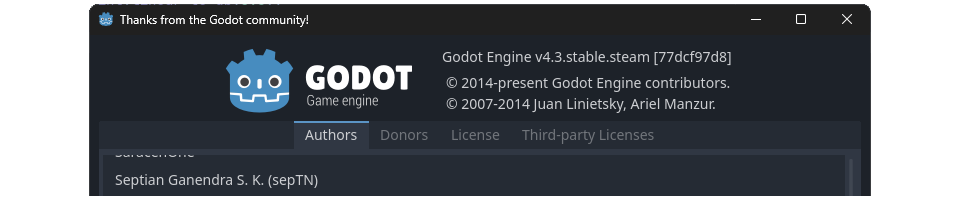

[English](README.md) | [Bahasa Indonesia](README.id.md)

# Septian Ganendra S. K. (sepTN)

Software engineer, game developer, dan pengajar bahasa Jepang asal Indonesia. Saya bikin game, bangun tools bahasa, dan berkontribusi ke open source.

Sebagian besar yang saya kerjakan masuk ke tiga kategori: game development, tools bahasa Jepang, dan kontribusi open source. Yang paling utama di ranah publik adalah **Jepang.org**, **Yomi**, **Sentou Gakuen: Revival**, dan beberapa tools serta dataset kecil yang saya jaga biar tetap cepat dan bisa dipakai offline.

## Sedang dikerjakan

- **Sentou Gakuen: Revival**: Visual novel massively multiplayer online yang dibangun menggunakan **Godot Engine**.
- **Steam (EA)**: [store.steampowered.com/app/405680/Sentou_Gakuen_Revival](https://store.steampowered.com/app/405680/Sentou_Gakuen_Revival/)
- **Steam Demo**: [store.steampowered.com/app/3175150/Sentou_Gakuen_Revival_Demo](https://store.steampowered.com/app/3175150/Sentou_Gakuen_Revival_Demo/)
- **Situs resmi**: [gakuen.org](https://gakuen.org)

## Yang saya kerjakan

### Game development

- **Godot Engine**: tercantum di [credits engine](https://godotengine.org/contact/#:~:text=Septian%20Ganendra%20S.%20K.%20%28sepTN%29)
- **GodotSteam**: tercantum di [credits kontributor](https://godotsteam.com/contribute/contributors/#:~:text=sepTN)
- **Lokalisasi Bahasa Indonesia Godot Engine**: [hosted.weblate.org/projects/godot-engine/-/id/#information](https://hosted.weblate.org/projects/godot-engine/-/id/#information)

### Language tech dan edukasi

- **Jepang.org**: platform belajar bahasa Jepang untuk orang Indonesia, mencakup JLPT, kanji, tata bahasa, kosakata, data anime, dan tool terkait
- **Yomi**: situs lookup dan referensi bahasa Jepang untuk mencari ungkapan bahasa Inggris dan kanji di [yomi.septn.com](https://yomi.septn.com)
- **Anime.Jepang.org**: jadwal anime dan database untuk pengguna Indonesia
- **Kanji.Jepang.org**: produk referensi kanji mandiri di dalam ekosistem yang lebih luas
- Fokus utama: **bahasa Jepang**, **JLPT**, **kanji**, **dataset**, **search**, dan **tooling** berorientasi NLP

## Repositori pilihan

- **kanji-data**: database kanji offline-first untuk Node.js dengan build-time sharding  
  [github.com/sepTN/kanji-data](https://github.com/sepTN/kanji-data)
- **Bunpou Lens**: analisis kalimat bahasa Jepang di sisi client dengan Kuromoji  
  [github.com/sepTN/bunpou-lens](https://github.com/sepTN/bunpou-lens)
- **kotowaza**: dataset peribahasa Jepang dengan arti bahasa Indonesia dan Inggris  
  [github.com/sepTN/kotowaza](https://github.com/sepTN/kotowaza)
- **kanji-png-gif**: generator gambar urutan goresan kanji secara terprogram  
  [github.com/sepTN/kanji-png-gif](https://github.com/sepTN/kanji-png-gif)

## Temukan saya

- **Website**: [septn.com](https://septn.com)
- **Jepang.org**: [jepang.org](https://jepang.org)
- **Yomi**: [yomi.septn.com](https://yomi.septn.com)
- **Gakuen.org**: [gakuen.org](https://gakuen.org)
- **npm**: [npmjs.com/~septn](https://www.npmjs.com/~septn)
- **GitHub**: [github.com/sepTN](https://github.com/sepTN)
