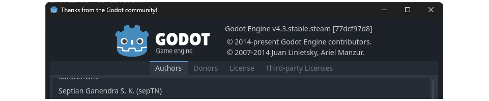

Hi, I'm sepTN, one of the Godot Engine developers from Indonesia and a contributor to GodotSteam. I'm also a proud volunteer to the translation of Godot Engine into [Bahasa Indonesia](https://hosted.weblate.org/projects/godot-engine/-/id/#information), helping to make the engine more accessible to the local community. You can check out my contributions to [Godot Engine](https://github.com/godotengine/godot/pulls?q=is%3Apr+author%3AsepTN) and [GodotSteam](https://github.com/CoaguCo-Industries/GodotSteam/pulls?q=is%3Apr+author%3AsepTN), where I enjoy helping make this fantastic engine even better!

